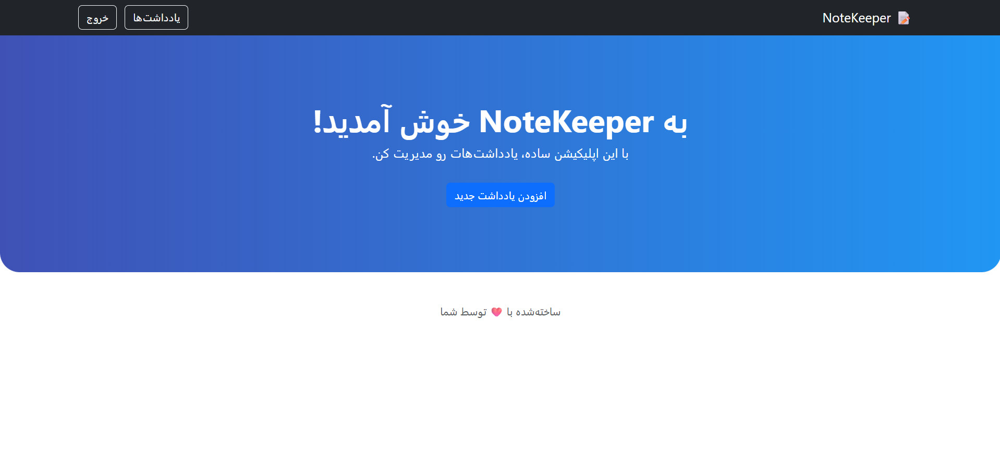
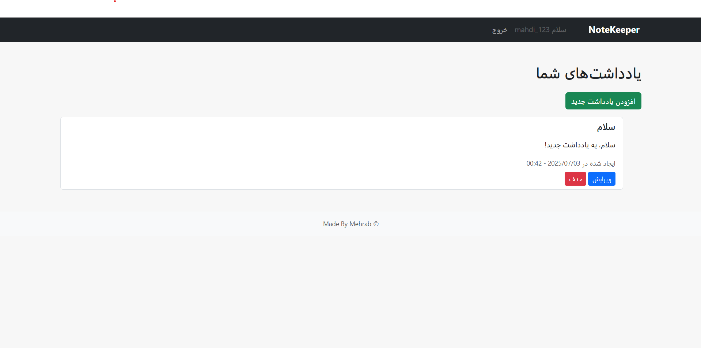

# NoteKeeper 📝

یک اپلیکیشن مدیریت یادداشت ساده با استفاده از Django و Bootstrap، طراحی‌شده به زبان فارسی و راست‌چین (RTL).

## ✨ ویژگی‌ها

- ثبت‌نام و ورود کاربران
- افزودن، مشاهده و حذف یادداشت‌ها
- رابط کاربری زیبا با Bootstrap
- محافظت‌شده با سیستم احراز هویت Django
- مناسب به عنوان نمونه‌کار Python/Django

## 🖼️ پیش‌نمایش



## 🚀 نحوه اجرا

### 1. محیط مجازی بساز:
```bash
python -m venv venv
source venv/bin/activate  # یا در ویندوز: venv\Scripts\activate

